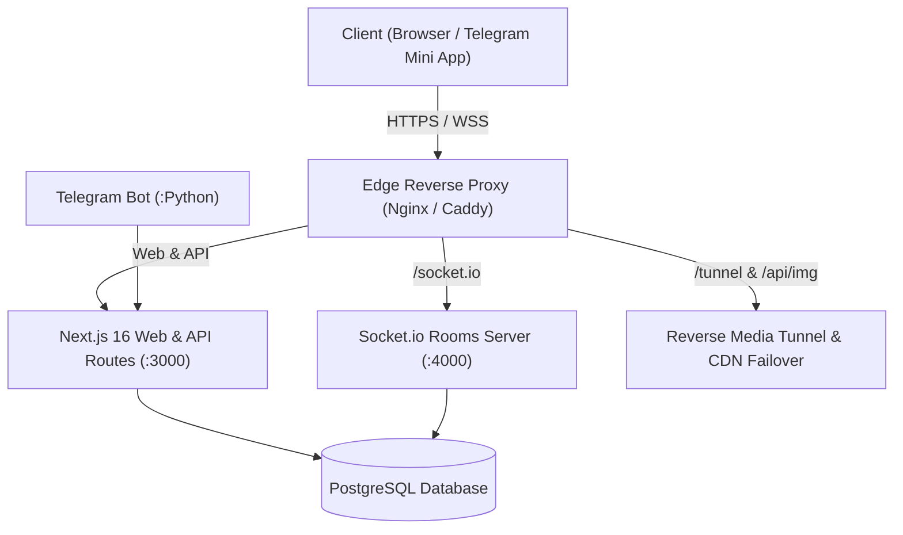

<div align="center">

# 🎬 AleX Cinema | أليكس سينما
### المنصة السينمائية المتطورة للمشاهدة الفردية والجماعية التزامنية
**The Next-Generation Social Streaming Platform & Watch Party Ecosystem**

[](https://nextjs.org/)
[](https://react.dev/)
[](https://www.typescriptlang.org/)
[](https://socket.io/)
[](https://tailwindcss.com/)
[](https://www.postgresql.org/)
[](https://www.docker.com/)
[](https://telegram.org/)

[الموقع الرسمي (Live)](https://cinax.live) • [التوثيق البرمجي (Docs)](docs/) • [خطة الطوارئ والاستعادة](docs/DISASTER_RECOVERY.md) • [نظام التصميم](DESIGN.md)

</div>

---

## 📖 نظرة عامة (Overview)

منصة **AleX Cinema** هي منظومة ترفيهية سينمائية متكاملة مصممة لتقديم تجربة مشاهدة فائقة السرعة وعالية الدقة للأفلام والمسلسلات، مع دعم استثنائي للمشاهدة الجماعية التزامنية في الوقت الفعلي (**Synchronized Watch Parties**) والتكامل العميق كتطبيق مصغر داخل تيليجرام (**Telegram Mini App**).

تتميز المنصة بتصميمها السينمائي الفاخر المستوحى من حجر الأوبسيديان والنيون القرمزي (**Obsidian Luxury Red**)، وتعتمد على خوادم وسيطة وأنفاق اتصال سحابية متطورة لتقديم تدفقات وسائط مستقرة وخالية من الانقطاع.

---

## ✨ أبرز المميزات (Key Features)

### 👥 1. غرف المشاهدة الجماعية الحية (Synchronized Watch Party)
* **تزامن فوري فائق الدقة (Zero-Lag Sync):** مزامنة لحظية للتشغيل، الإيقاف، التقديم، والترجيع بين كافة المشاهدين عبر WebSockets و Socket.io.
* **دردشة تفاعلية مدمجة:** نظام دردشة حية مع تفاعلات الإيموجي العائمة، الردود، وشارات المشرفين والضيوف.
* **إدارة الغرف:** إمكانية إنشاء غرف عامة أو خاصة برمز سري، ونقل التحكم بين المشرفين.

### 📱 2. تكامل أصيل مع تيليجرام (Telegram Mini App Ecosystem)
* تشغيل فوري وسلس كـ **Telegram WebApp** داخل التطبيق بدون الحاجة لمتصفح خارجي.
* مصادقة موحدة وتلقائية عبر `Telegram WebApp InitData` مع نظام جلسات مشفر.
* بوت تيليجرام ذكي لاستقبال أوامر البحث، مشاركة روابط الغرف، وبث المحتوى.

### 🎥 3. مشغل سينمائي متقدم (AlexPlayer Engine)
* مشغل فيديو مخصص يدعم جودات متعددة، تخطي شارة البداية، وتعديل سرعة البث.
* دعم متعدد للترجمات والصوتيات مع مظهر داكن أنيق يمنع التشتت البصري.
* التبديل التلقائي الذكي بين مصادر البث الاحتياطية (Failover Streaming).

### 🌐 4. معمارية الأنفاق وكسر الحظر الجغرافي (Hybrid Reverse Tunnel)
* وسيط Nginx متطور لإعادة توجيه وكاش الوسائط والصور عبر شبكات CDN متعددة.
* نظام مراقبة دوري (Watchdog) للتحقق الدائم من جودة واتصال نفق الوسائط.

---

## 🏗️ المعمارية التقنية (Architecture & Tech Stack)



| المكون | التقنية المستخدمة | الدور والوظيفة |
|:-------|:------------------|:---------------|
| **Frontend & API** | Next.js 16 (React 19, TypeScript) | الواجهة السينمائية، صفحات التصفح، وواجهات البرمجة الخلفية. |
| **Styling** | TailwindCSS + Obsidian Design System | تصميم داكن فاخر مع هوية بصرية مريحة للعين وخالية من تسريب الضوء. |
| **Realtime Sync** | Node.js + Socket.io | خادم التزامن اللحظي للغرف والدردشة المباشرة. |
| **Database & ORM** | PostgreSQL + Prisma ORM | حفظ بيانات الحسابات، الغرف، الرسائل، والمفضلات. |
| **Authentication** | Clerk Auth + Telegram WebApp Auth | مصادقة آمنة ثنائية تدعم المتصفحات الرسمية وحسابات تيليجرام. |
| **Bots & Tools** | Python 3 (Telebot / Pyrogram) | بوت المنصة الرسمي وبوت التحميل والموسيقى المساعد. |
| **Containerization** | Docker & Docker Compose | إدارة الحاويات، عزل الخدمات، وسهولة النقل والاستعادة. |

---

## 📁 هيكل المشروع (Project Structure)

```text
alex-cinema/
├── docs/                       # التوثيق الفني وأدلة التشغيل والاستعادة
│   ├── DISASTER_RECOVERY.md    # خطة الاستعادة والنقل في حالات الطوارئ
│   └── DOCKER_DEPLOYMENT.md    # دليل النشر والتوزيع عبر Docker
├── docker/                     # ملفات تكوين الحاويات والشبكات
│   ├── caddy/                  # إعدادات خادم Caddy للتشفير التلقائي
│   ├── nginx/                  # وسيط التوجيه وكاش الوسائط
│   ├── postgres/               # نصوص النسخ الاحتياطي والاستعادة
│   └── tunnel-sshd/            # خادم نفق الـ SSH العكسي
├── prisma/                     # مخططات قاعدة البيانات ومسارات الترحيل
│   ├── schema.prisma           # مخطط الجداول والعلاقات (Prisma Schema)
│   └── migrations/             # سجل الترحيلات التاريخية
├── public/                     # الملفات الثابتة، الشعارات، والأيقونات
├── scripts/                    # أدوات الأتمتة، النسخ الاحتياطي، والنشر
│   ├── backup-docker.sh        # سكريبت أخذ نسخة احتياطية من قاعدة البيانات
│   ├── deploy-docker.sh        # سكريبت النشر الآمن للحاويات
│   └── generate_bot_cover.js   # أداة توليد غلاف بوت التيليجرام
├── src/                        # الكود المصدري للتطبيق
│   ├── app/                    # مسارات Next.js App Router و API Routes
│   │   ├── api/                # واجهات البرمجة (auth, rooms, img, proxy)
│   │   ├── movies/             # متصفح الأفلام
│   │   ├── series/             # متصفح المسلسلات والمواسم
│   │   └── room/               # واجهة غرف المشاهدة الجماعية
│   ├── components/             # مكونات الواجهة القابلة لإعادة الاستخدام
│   │   ├── player/             # مشغل AlexPlayer المتطور
│   │   ├── room/               # عناصر الدردشة والتحكم في الغرفة
│   │   └── telegram/           # مكونات تطبيق تيليجرام المصغر
│   └── lib/                    # المكتبات المساعدة، دوال التشفير، والمصادقة
├── socket-server.js            # خادم السوكيت المستقل للمشاهدة الحية
├── telegram_bot.py             # بوت التيليجرام الرسمي للمنصة
├── tunnel_watchdog_vps.js      # مراقب استقرار نفق الوسائط
├── compose.yaml                # تكوين خدمات الإنتاج عبر Docker Compose
├── DESIGN.md                   # دليل المعايير التصميمية الصارمة (Design System)
├── PRODUCT.md                  # وثيقة متطلبات المنتج وأهدافه
└── PROJECT_MEMORY.md           # ملف الذاكرة المركزية والهندسة المعمارية
```

---

## 🚀 البدء والتشغيل (Getting Started)

### متطلبات التشغيل الأساسية:
* **Node.js:** الإصدار 18 أو أحدث (يوصى بـ Node 20/22).
* **Python:** الإصدار 3.10 أو أحدث (لتشغيل البوت).
* **PostgreSQL:** الإصدار 15 أو أحدث.
* **Docker & Docker Compose:** (في حال التشغيل عبر الحاويات).

### 💻 التشغيل المحلي للتطوير (Local Development):

1. **استنساخ المستودع:**
   ```bash
   git clone https://github.com/Gaoc3/alex-cinema.git
   cd alex-cinema
   ```

2. **تثبيت الحزم البرمجية:**
   ```bash
   npm install
   ```

3. **إعداد متغيرات البيئة:**
   ```bash
   cp .env.example .env
   # قم بتعديل قيم .env ببيانات قاعدة البيانات ومفاتيح المصادقة الخاصة بك
   ```

4. **تجهيز وترحيل قاعدة البيانات:**
   ```bash
   npx prisma generate
   npx prisma migrate deploy
   ```

5. **بدء بيئة التطوير:**
   * تشغيل تطبيق الويب:
     ```bash
     npm run dev
     ```
   * تشغيل خادم السوكيت التزامني (في نافذة أخرى):
     ```bash
     node socket-server.js
     ```
   * تشغيل بوت التيليجرام (اختياري):
     ```bash
     pip install -r requirements-bot.txt
     python telegram_bot.py
     ```

---

## 🐳 النشر السحابي بالإنتاج (Production Deployment)

### الخيار الأول: النشر عبر Docker Compose (الموصى به)
توفر المنصة حزمة Compose متكاملة تعزل كل خدمة في حاوية خاصة مع نسخ احتياطي وتشفير تلقائي:

```bash
# 1. إعداد البيئة والحاويات
sudo ./scripts/install-docker-debian.sh
./scripts/prepare-docker.sh

# 2. تعديل ملف المتغيرات
nano .env.docker

# 3. إطلاق المنظومة بالكامل
./scripts/deploy-docker.sh
```

للمزيد من تفاصيل النشر والربط بالراوتر، راجع [دليل النشر عبر Docker](docs/DOCKER_DEPLOYMENT.md).

### الخيار الثاني: النشر اليدوي عبر PM2
```bash
npm run build
pm2 start socket-server.js --name alex-socket
pm2 start npm --name cinemana -- start
pm2 start python3 --name alex-telegram-bot -- telegram_bot.py
pm2 save
```

---

## 🛡️ الأمان والخصوصية (Security & Privacy)

* **عزل الأسرار:** لا يتم حفظ أو رفع أي مفاتيح تشفير أو كلمات سر حقيقية داخل المستودع.
* **حماية التوكنات:** توكنات الغرف والسوكيت مؤقتة ومحدودة الصلاحية (`SOCKET_AUTH_SECRET`).
* **النسخ الاحتياطي الدوري:** سكريبتات دورية لإنشاء نسخ مشفرة لقاعدة البيانات والتحقق من بصمة التشفير `SHA-256`.

---

## 📄 الترخيص (License)
جميع الحقوق محفوظة لمنصة **AleX Cinema** © 2026.
