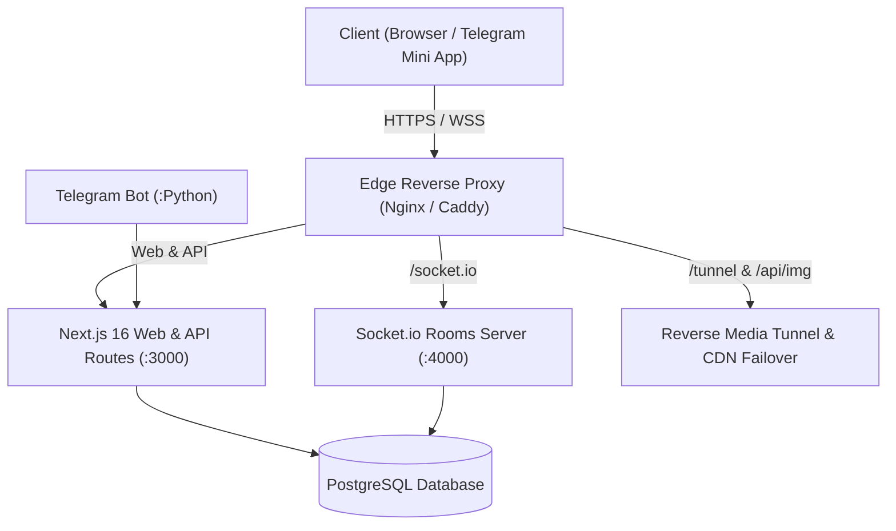

<div align="center">

# 🎬 AleX Cinema
### The Next-Generation Social Streaming Platform & Synchronized Watch Party Ecosystem
**High-performance cinema streaming, real-time social watching, and native Telegram Mini App integration**

[](https://nextjs.org/)
[](https://react.dev/)
[](https://www.typescriptlang.org/)
[](https://socket.io/)
[](https://tailwindcss.com/)
[](https://www.postgresql.org/)
[](https://www.docker.com/)
[](https://telegram.org/)

[Official Website (Live)](https://cinax.live) • [Documentation (Docs)](docs/) • [Disaster Recovery Plan](docs/DISASTER_RECOVERY.md) • [Design System](DESIGN.md)

</div>

---

## 📖 Overview

**AleX Cinema** is an enterprise-grade, theater-quality entertainment platform engineered for lightning-fast, high-definition streaming of films and series. It provides first-class support for **real-time synchronized watch parties** and deep native integration as a **Telegram Mini App**.

Featuring a luxury dark cinematic design system (**Obsidian Luxury Red**), the platform leverages hybrid cloud reverse tunnels, edge caching proxies, and multi-CDN failover networks to deliver ultra-stable, zero-buffering media streams across distributed networks.

---

## ✨ Key Features

### 👥 1. Synchronized Watch Parties
* **Zero-Lag Real-Time Sync:** Frame-accurate synchronization for playback, pausing, seeking, and episode transitions across all room participants via WebSockets and Socket.io.
* **Integrated Interactive Chat:** Live room chat featuring floating animated emoji reactions, replies, and distinctive roles for hosts, moderators, and viewers.
* **Granular Room Administration:** Create public lobbies or passcode-protected private screening rooms with dynamic host-to-moderator permission delegation.

### 📱 2. Native Telegram Mini App Ecosystem
* Instant, seamless launch directly as a **Telegram WebApp** inside chat threads without external browser redirects.
* Unified zero-click authentication utilizing cryptographic `Telegram WebApp InitData` session verification.
* Intelligent companion Telegram bot for instant media search, room invitation sharing, and content broadcasting.

### 🎥 3. Advanced AlexPlayer Engine
* Custom-built HLS video player supporting adaptive multi-bitrate streaming, auto skip-intro, and variable playback speeds.
* Multi-track audio and subtitle support wrapped in a distraction-free dark theater frame.
* Intelligent automatic failover switching across redundant upstream streaming endpoints.

### 🌐 4. Hybrid Reverse Tunnel Architecture
* Nginx edge reverse proxy handling dynamic stream routing, URL rewriting, and caching across multiple CDN nodes.
* Dedicated daemon watchdog ensuring 24/7 tunnel health, connection monitoring, and automatic failover.

---

## 🏗️ Architecture & Tech Stack



| Component | Technology | Role & Function |
|:----------|:-----------|:----------------|
| **Frontend & API** | Next.js 16 (React 19, TypeScript) | Cinematic user interface, catalog browsing, and backend API routes. |
| **Styling** | TailwindCSS + Obsidian Design System | Luxury dark theme with high-contrast obsidian depth and crimson neon glows. |
| **Realtime Sync** | Node.js + Socket.io | Ultra-low latency rooms server for synchronous playback and live chat. |
| **Database & ORM** | PostgreSQL + Prisma ORM | Persistent storage for accounts, watch party rooms, messages, and bookmarks. |
| **Authentication** | Clerk Auth + Telegram WebApp Auth | Secure dual authentication supporting modern web browsers and Telegram sessions. |
| **Bots & Automation** | Python 3 (Telebot / Pyrogram) | Official Telegram companion bot and automated media ingestion tooling. |
| **Containerization** | Docker & Docker Compose | Containerized service isolation, environment consistency, and one-command deployment. |

---

## 📁 Project Structure

```text
alex-cinema/
├── docs/                       # Technical documentation, deployment, and recovery guides
│   ├── DISASTER_RECOVERY.md    # Disaster recovery and server migration runbook
│   └── DOCKER_DEPLOYMENT.md    # Production deployment guide via Docker Compose
├── docker/                     # Container configuration and reverse proxy setups
│   ├── caddy/                  # Caddy configuration for automatic TLS termination
│   ├── nginx/                  # Media cache and reverse proxy rules
│   ├── postgres/               # Database backup and restoration routines
│   └── tunnel-sshd/            # Restricted reverse SSH tunnel daemon
├── prisma/                     # Database schema definitions and migration history
│   ├── schema.prisma           # Prisma schema with relational models
│   └── migrations/             # Timestamped SQL migration files
├── public/                     # Static assets, branding logos, and icons
├── scripts/                    # Automation scripts for deployment and maintenance
│   ├── backup-docker.sh        # Automated database backup and SHA-256 validation
│   ├── deploy-docker.sh        # Safe zero-downtime containerized deployment script
│   └── generate_bot_cover.js   # Dynamic Telegram bot branding generator
├── src/                        # Main application source code
│   ├── app/                    # Next.js App Router pages and API routes
│   │   ├── api/                # Backend endpoints (auth, rooms, img proxy, etc.)
│   │   ├── movies/             # Movie catalog and detail view routes
│   │   ├── series/             # TV series and season navigation routes
│   │   └── room/               # Real-time watch party room interface
│   ├── components/             # Reusable UI component library
│   │   ├── player/             # Custom AlexPlayer video engine
│   │   ├── room/               # Watch party controls, participant lists, and chat
│   │   └── telegram/           # Native Telegram Mini App bridge components
│   └── lib/                    # Shared utilities, crypto helpers, and auth clients
├── socket-server.js            # Standalone Socket.io real-time synchronization server
├── telegram_bot.py             # Official Telegram companion bot
├── tunnel_watchdog_vps.js      # Media tunnel stability and watchdog monitor
├── compose.yaml                # Multi-container production Docker Compose definition
├── DESIGN.md                   # Strict visual guidelines and design tokens
├── PRODUCT.md                  # Product specifications and feature requirements
└── PROJECT_MEMORY.md           # Core architectural memory and engineering reference
```

---

## 🚀 Getting Started

### Prerequisites:
* **Node.js:** v18.0 or newer (v20 / v22 recommended).
* **Python:** v3.10 or newer (for companion bot).
* **PostgreSQL:** v15 or newer.
* **Docker & Docker Compose:** (for containerized setup).

### 💻 Local Development Setup:

1. **Clone the repository:**
   ```bash
   git clone https://github.com/Gaoc3/alex-cinema.git
   cd alex-cinema
   ```

2. **Install dependencies:**
   ```bash
   npm install
   ```

3. **Configure environment variables:**
   ```bash
   cp .env.example .env
   # Edit .env with your database URL, Clerk keys, and secret tokens
   ```

4. **Initialize database schema:**
   ```bash
   npx prisma generate
   npx prisma migrate deploy
   ```

5. **Start development services:**
   * Start web application:
     ```bash
     npm run dev
     ```
   * Start real-time socket server (in a separate terminal):
     ```bash
     node socket-server.js
     ```
   * Start Telegram companion bot (optional):
     ```bash
     pip install -r requirements-bot.txt
     python telegram_bot.py
     ```

---

## 🐳 Production Deployment

### Option 1: Docker Compose (Recommended)
The platform includes an automated Compose stack isolating each service with health checks, automated backups, and SSL management:

```bash
# 1. Prepare host environment
sudo ./scripts/install-docker-debian.sh
./scripts/prepare-docker.sh

# 2. Configure environment variables
nano .env.docker

# 3. Launch full stack
./scripts/deploy-docker.sh
```

For advanced edge routing and router setup, consult the [Docker Deployment Guide](docs/DOCKER_DEPLOYMENT.md).

### Option 2: Traditional Host Deployment (PM2)
```bash
npm run build
pm2 start socket-server.js --name alex-socket
pm2 start npm --name cinemana -- start
pm2 start python3 --name alex-telegram-bot -- telegram_bot.py
pm2 save
```

---

## 🛡️ Security & Privacy

* **Zero Secret Leakage:** No private keys, credentials, or production tokens are committed to source control.
* **Ephemeral Tokens:** Watch party sessions and socket connections are secured with time-limited JWTs (`SOCKET_AUTH_SECRET`).
* **Automated Backup & Verification:** Automated database backups with cryptographic `SHA-256` checksum verification.

---

## 👨‍💻 Author & Lead Architect

* **Hussain Ibrahim Ahmed (Gaoc3)**  
  *Systems & Backend Software Engineer | Distributed Infrastructure & DevOps*  
  [LinkedIn](https://www.linkedin.com/in/zack-accer) • [GitHub](https://github.com/Gaoc3) • [Email](mailto:secon2636@gmail.com)

---

## 📄 License

All rights reserved to **AleX Cinema** © 2026.
